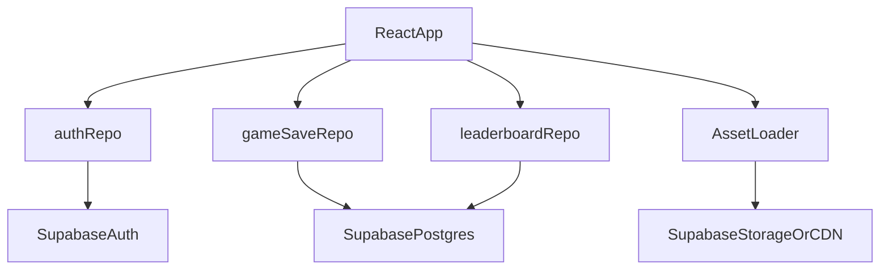

# Base44 to Supabase Migration + TypeScript Big-Bang

> **Current codebase:** Story saves and leaderboard use **`src/lib/localEntities.js`** (`localStorage`). The Base44 npm packages, Vite plugin, and `base44/` directory are **removed**. Human-readable shapes live under [`schemas/entities/`](schemas/entities/). The sections below are **historical migration notes**, not the active architecture.

## Purpose

This document is the execution blueprint to:

1. Remove all Base44 runtime/dependency coupling.
2. Move auth, data, and storage under infrastructure we control (Supabase).
3. Convert the entire application from JavaScript/JSX to TypeScript/TSX in one coordinated migration branch.

The target is one major migration stream with explicit phase gates, test criteria, and rollback steps.

---

## Current-State Dependency Inventory

### Base44 Runtime and Build Coupling

- `src/api/base44Client.js` (SDK bootstrap)
- `src/lib/app-params.js` (Base44 token/app URL contract)
- `src/lib/AuthContext.jsx` (`base44.auth.me/logout/redirectToLogin`)
- `vite.config.js` (`@base44/vite-plugin`)
- `package.json` (`@base44/sdk`, `@base44/vite-plugin`)
- `README.md` (Base44 env setup)

### Base44 Entity Usage (to replace)

- Game saves:
  - `src/pages/Home.jsx`
  - `src/pages/GameDay.jsx`
  - `src/pages/WeeklySummary.jsx`
  - `src/pages/NewGame.jsx`
  - `src/components/game/SaveManager.jsx`
  - `src/components/game/DebugPanel.jsx`
  - `src/components/game/BakeryCustomizer.jsx`
- Leaderboard:
  - `src/lib/leaderboard.js`

### Entity-shaped schemas (reference only)

- [`schemas/entities/GameSave.jsonc`](schemas/entities/GameSave.jsonc)
- [`schemas/entities/LeaderboardEntry.jsonc`](schemas/entities/LeaderboardEntry.jsonc)

### Former CDN-hosted assets (removed from `src/`)

Portrait art uses inline SVG data URIs in [`src/lib/localAssets.js`](src/lib/localAssets.js). Locale backgrounds use `VILLAGES[*].bgImage` (external Unsplash URLs in [`src/lib/gameData.js`](src/lib/gameData.js)), not any vendor CDN tied to the old hosted backend.

---

## Target Architecture (Supabase)

### Core Decisions

- Auth: Supabase Auth (`@supabase/supabase-js`) with email/password or magic-link (decide once, keep consistent with current UX).
- Database: Supabase Postgres.
- Storage: Supabase Storage buckets for controlled game assets/sprites (or first-party CDN).
- Frontend boundary: repository layer in `src/api` so pages/components never talk directly to Supabase client.

### High-Level Data Flow

### Ownership Model

- Environment variables and keys owned in our deployment platform.
- DB schema owned via SQL migrations in-repo.
- Backups and point-in-time restore configured in Supabase.
- RLS policies versioned and reviewed like application code.

---

## Data Model Mapping and SQL Plan

Use Base44 entity files as source contracts and map to SQL tables with JSONB for nested structures.

### Table: `game_saves`

Suggested schema:

- `id uuid primary key default gen_random_uuid()`
- `user_id uuid not null` (references `auth.users(id)` logically; FK via `auth.users` strategy)
- `player_name text not null`
- `bakery_name text not null`
- `village text not null`
- `difficulty text not null check (difficulty in ('beginner','easy','medium','hard','expert'))`
- `current_week int not null default 0`
- `current_day int not null default 1`
- `total_coins numeric(12,2) not null default 0`
- `weekly_sales jsonb not null default '[]'::jsonb`
- `streak int not null default 0`
- `total_customers_served int not null default 0`
- `tutorial_complete boolean not null default false`
- `recipe_book jsonb not null default '{}'::jsonb`
- `equipped_recipe_ids text[] not null default '{}'`
- `menu_slots jsonb not null default '{"maxSlots":6,"unlockedSlots":6}'::jsonb`
- `created_at timestamptz not null default now()`
- `updated_at timestamptz not null default now()`

Recommended indexes:

- `create index idx_game_saves_user_updated on game_saves(user_id, updated_at desc);`
- `create index idx_game_saves_user_village on game_saves(user_id, village);`
- `create index idx_game_saves_user_difficulty on game_saves(user_id, difficulty);`

### Table: `leaderboard_entries`

Suggested schema:

- `id uuid primary key default gen_random_uuid()`
- `player_name text not null`
- `bakery_name text not null default ''`
- `score numeric(12,2) not null`
- `difficulty text not null check (difficulty in ('beginner','easy','medium','hard','expert'))`
- `accuracy_pct int not null default 0 check (accuracy_pct between 0 and 100)`
- `customers_served int not null default 0`
- `village text not null default ''`
- `tips_earned numeric(12,2) not null default 0`
- `correct_transactions int not null default 0`
- `created_by uuid null`
- `created_at timestamptz not null default now()`

Recommended indexes:

- `create index idx_leaderboard_score_desc on leaderboard_entries(score desc, created_at asc);`
- `create index idx_leaderboard_player_score on leaderboard_entries(player_name, score desc);`
- `create index idx_leaderboard_filters on leaderboard_entries(difficulty, village, score desc);`

### RLS Policy Strategy

`game_saves`:

- select/update/delete: only row owner (`auth.uid() = user_id`)
- insert: only with `user_id = auth.uid()`

`leaderboard_entries`:

- select: public read (if leaderboard is public)
- insert: authenticated users allowed (set `created_by = auth.uid()`)
- update/delete: owner only or admin role only (recommended owner-only by default)

### Data Migration Script Approach

1. Export Base44 entities (`GameSave`, `LeaderboardEntry`) to JSON/CSV.
2. Transform fields to SQL-compatible payloads.
3. Resolve user identity mapping:
   - if Base44 user IDs are available, create a mapping table to Supabase `auth.users.id`
   - otherwise use deterministic import strategy and attach orphaned saves to seeded users for manual reconciliation
4. Bulk import using Supabase SQL COPY or batched upserts via script.
5. Run parity checks before switching runtime traffic.

### Data Validation Checklist

- Row counts equal within expected tolerances (after dedupe rules).
- 20 random saves validated for nested fields (`recipe_book`, `menu_slots`, `equipped_recipe_ids`).
- Top-100 leaderboard parity by score/order.
- Recent-saves query parity for active users.

---

## Auth Migration Plan

Current auth behavior in `src/lib/AuthContext.jsx` must be preserved with Supabase:

- replace `base44.auth.me()` -> `supabase.auth.getUser()`
- replace `base44.auth.logout()` -> `supabase.auth.signOut()`
- replace `base44.auth.redirectToLogin()` -> app route redirect to login page (or hosted auth route)

### Required UX Parity

- Keep loading split: auth-loading vs settings-loading states.
- Preserve current error semantics:
  - `auth_required`
  - `user_not_registered`
  - `unknown`
- Restore session on app boot and handle token expiry gracefully.

### Implementation Notes

- Remove Base44 public-settings endpoint usage (`/api/apps/public/prod/public-settings/by-id/:id`).
- Introduce app settings source controlled by us:
  - static config file for initial migration, or
  - Supabase table `app_public_settings` for dynamic behavior.

---

## API/Repository Refactor Plan

Create a stable repository seam first, then swap internals:

- `src/api/supabaseClient.ts`
- `src/api/repos/gameSaveRepo.ts`
- `src/api/repos/leaderboardRepo.ts`
- `src/api/repos/authRepo.ts`
- `src/api/types.ts` (shared DTO/domain types)

### Compatibility-First Method Surface

Keep method signatures close to current call sites to reduce churn:

- Game saves:
  - `list(order, limit)`
  - `filter(criteria, order?, limit?)`
  - `create(payload)`
  - `update(id, patch)`
  - `delete(id)`
- Leaderboard:
  - `create`, `list`, `filter`, `delete`

Then replace `@/api/base44Client` imports in:

- `src/pages/Home.jsx`
- `src/pages/GameDay.jsx`
- `src/pages/NewGame.jsx`
- `src/pages/WeeklySummary.jsx`
- `src/components/game/SaveManager.jsx`
- `src/components/game/DebugPanel.jsx`
- `src/components/game/BakeryCustomizer.jsx`
- `src/lib/leaderboard.js`
- `src/lib/AuthContext.jsx`

### Cutover Rule

No direct Supabase calls in pages/components. Only repos can access the client.

---

## Build and Dependency Cutover

### Package and Config Changes

- Remove from `package.json`:
  - `@base44/sdk`
  - `@base44/vite-plugin`
- Add:
  - `@supabase/supabase-js`
- Update `vite.config.js`:
  - remove Base44 plugin wiring entirely
- Replace env vars:
  - remove `VITE_BASE44_APP_ID`
  - remove `VITE_BASE44_APP_BASE_URL`
  - remove `VITE_BASE44_FUNCTIONS_VERSION`
  - add `VITE_SUPABASE_URL`
  - add `VITE_SUPABASE_ANON_KEY`

### Non-Code Cleanup

- Update `README.md` setup steps to Supabase flow.
- Remove Base44 URLs/branding in `index.html` where applicable.
- Move media assets from `media.base44.com` to Supabase Storage/CDN and update references.

---

## TypeScript Big-Bang Conversion Plan

This is a **single coordinated branch migration**. Feature work pauses until merge.

### Phase TS-0: Compiler/Tooling Baseline

1. Create `tsconfig.json` (do not keep typecheck on `jsconfig.json`).
2. Configure alias parity for `@/*`.
3. Enable strict baseline:
   - `"strict": true`
   - `"noUncheckedIndexedAccess": true`
   - `"exactOptionalPropertyTypes": true`
4. Allow temporary transition flags only if needed and tracked:
   - `"skipLibCheck": true` (temporary allowed)

### Phase TS-1: Domain Types First

Create explicit types before file renames:

- `src/types/game.ts`:
  - `GameSave`
  - `LeaderboardEntry`
  - `VillageKey`, `Difficulty`, `RoleKey`
  - nested types: `RecipeBookState`, `MenuSlots`, `WeeklySalesSummary`

Use runtime-safe parsing for localStorage/JSON boundaries.

### Phase TS-2: Core Library Conversion

Convert all `src/lib/*.js` -> `.ts` (or `.tsx` if React present), starting with:

- `src/lib/economyEngine.js`
- `src/lib/timerEngine.js`
- `src/lib/gameData.js`
- `src/lib/recipeBook.js`
- `src/lib/recipeData.js`
- `src/lib/gameEngine.js`
- `src/lib/customerPortraitInventory.js`
- `src/lib/leaderboard.js`
- `src/lib/AuthContext.jsx` -> `src/lib/AuthContext.tsx`

### Phase TS-3: Hooks and API

- Convert `src/hooks/*` to typed hooks.
- Convert `src/api/*` to TypeScript.
- Ensure repository method return types are explicit and not inferred from `any`.

### Phase TS-4: Components and Pages

Convert all `src/components/**/*.jsx` and `src/pages/**/*.jsx` to `.tsx`.

Priority order:

1. `src/components/ui/*` primitives
2. `src/components/game/*`
3. `src/pages/*`
4. `src/App.jsx` -> `src/App.tsx`
5. `src/main.jsx` -> `src/main.tsx`

### Type Quality Rules

- No `any` in repos, domain models, or engine logic.
- UI-only emergency `any` allowed only with `TODO(ts-migration):` tag and issue reference.
- Replace dynamic object access with typed records/unions where possible.
- Add type guards for parsed JSON and optional nested objects.

### Big-Bang Exit Criteria

- Zero `.js`/`.jsx` files remain under `src/`.
- `npm run build`, `npm run lint`, and typecheck all pass.

---

## Execution Order and Gates

### Gate A: Supabase Foundation Ready

- Supabase project provisioned.
- SQL schema + indexes + RLS policies applied.
- Environment variables configured in all environments.

### Gate B: Runtime Decoupling Complete

- Repository layer implemented and used.
- No runtime imports from `@base44/sdk`.
- No code path references `base44.*`.

### Gate C: TypeScript Big-Bang Complete

- All application files converted to `.ts/.tsx`.
- Strict typecheck passes.
- Lint/build pass.

### Gate D: Regression Pass

- Story mode flow validated:
  - new game creation
  - day progression
  - save updates
  - weekly summary
- Arcade mode flow validated:
  - setup
  - play loop
  - score tally
  - leaderboard write
- Auth and logout/login behavior validated.

No production cutover until all gates pass.

---

## Risk Register and Mitigations

### Risk 1: Dynamic game state typing complexity

Hotspots:

- `src/lib/gameEngine.js`
- `src/lib/gameData.js`
- `src/lib/recipeData.js`
- `src/pages/GameDay.jsx`
- `src/pages/ArcadePlay.jsx`

Mitigation:

- Introduce discriminated unions for problem types/phase states.
- Add narrow helper functions for state transitions.
- Add targeted unit tests for day lifecycle and scoring.

### Risk 2: JSON/localStorage schema drift

Hotspots:

- `src/data/spriteOrganizerPortraitIndex.json` (generated index; `npm run build-sprite-index`)
- `src/lib/localNames.js`
- `src/lib/freeSessionState.js`

Mitigation:

- Runtime validators and defaults on parse.
- Versioned cache payloads and migration function per version.

### Risk 3: Data migration mismatches

Mitigation:

- Dry-run imports in staging.
- Automated parity reports (counts, score distributions, sample diff).
- Freeze writes during final cutover window.

### Risk 4: Leaderboard behavior drift

Hotspot:

- `src/lib/leaderboard.js` (dedup + sorting assumptions)

Mitigation:

- Keep functional behavior contract same during repo swap.
- Add integration tests for dedup, top N, and player history reads.

---

## Validation Test Matrix

### Functional Smoke Tests

- Home renders and loads saves for authenticated user.
- New game creates save and routes into gameplay.
- GameDay updates save and persists key counters.
- Weekly summary loads expected history.
- Arcade play records exactly one leaderboard row per run.
- Leaderboard sorting/filtering parity with old behavior.

### Data Integrity Tests

- `game_saves` ownership enforced by RLS.
- Users cannot read/write another user save.
- Public leaderboard read works without privileged key.
- Score and accuracy bounds preserved.

### Type Safety Checks

- Typecheck in CI blocks merge on errors.
- No untracked `any` in core modules.
- No `.js/.jsx` files in `src/`.

---

## Rollback Strategy

Use staged rollout with rollback checkpoints:

1. Keep pre-migration release branch deployable.
2. Perform migration in staging first with production-like data snapshot.
3. For production cutover:
   - short write freeze window
   - final export/import
   - deploy new runtime
4. If critical regression occurs:
   - revert frontend deploy to pre-migration build
   - restore write path to Base44-backed runtime if still available, or preserve read-only mode while issue is fixed
   - replay buffered writes manually if needed

Do not delete Base44 export artifacts until Supabase production has passed stability window (at least one full release cycle).

---

## Definition of Done

- No imports from Base44 packages remain.
- No runtime reference to `base44` API remains in `src/`.
- All app source files are `.ts/.tsx`.
- `npm run build`, `npm run lint`, and typecheck pass.
- Story mode, Arcade mode, save management, leaderboard, and auth are behaviorally equivalent to the baseline.
