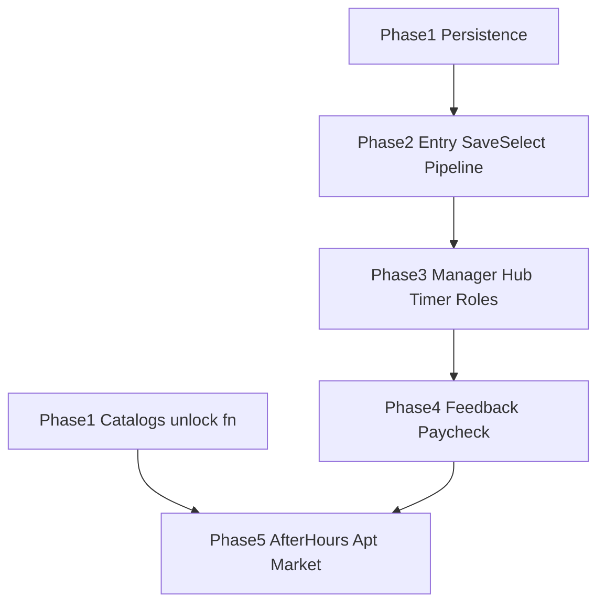

# Story Mode implementation plan

Actionable build sequence derived from the design conversation (reference: [.cursor/rules/cakery-story-mode.mdc](../.cursor/rules/cakery-story-mode.mdc)). Use this document as the master checklist when implementing story mode.

**Scope reminder:** prioritize game logic, storage, and UI behavior. **Do not generate new graphic or audio assets** unless the project owner explicitly asks; instead, track asset needs below and request files from the owner.

---

## Persistence (locked — offline-only)

Story saves and leaderboard rows live in **`localStorage`** via [`src/lib/localEntities.js`](../src/lib/localEntities.js). **No third-party hosted game backend** — use explicit export/import files if you add sync later.

The design doc’s **five-slot UI**, PIN lock, and duplicate/replace flows should be implemented **on top of** this API (today: flat list keyed `cakery_bakery_v1_game_saves`; slots can wrap or partition that array).

---

## Commands (use every slice)

Run from repo root:

```bash
npm install
npm run dev
```

Verify compile:

```bash
npm run build
```

Optional hygiene:

```bash
npm run lint
npm run typecheck
```

(`typecheck` may report existing JSX typing noise; fix only when touching those files.)

---

## Phase 1 — Foundation

1. **Persist strategy** — Extend [`src/lib/localEntities.js`](../src/lib/localEntities.js) (or add `storySaveRepository.js`) with slot semantics: `listSlots()`, `readSlot(i)`, `writeSlot(i)`, `clearSlot(i)`, `duplicate`, `validatePin`, etc.
2. **Slot model** — Fixed array length **5**; empty slots `null`; filled entries hold `{ gameSavePayload, locked?, pinHash? }` (PIN: simple local protection only, not cryptographic security).
3. **Commit rule** — No persisted save until **both** player name and bakery name exist **and** final “Start Game” (or equivalent) fires (matches design).
4. **Global catalogs** — Add modular JSON/JS modules for catalog data: `ITEM_DATABASE`, `RECIPE_DATABASE`, optional `LOCALE_DATABASE`. Each item supports `unlock_condition: null | { type, value }` for future DLC.
5. **`isUnlocked(item, save)`** — Single pure function used by Market/UI; supports week-gates etc. later.
6. **GameSave shape extensions** (where persisted): `apartment: { owned_items, equipped }`, `recipes.unlocked`, `status: { fatigue, active_buffs }`, plus session-only structs documented as non-persistent.

**Exit criteria:** unit-testable repository + catalogs load; creating/deleting slot round-trips without loading `GameDay`.

---

## Phase 2 — Entry flow (Story → slots → new/resume)

7. **Routing** — `/story` or equivalent from Story Mode button → Save Select (5 slot grid + separate **+ Create New**).
8. **Save Select UI** — Filled card: Continue primary, ⚙️ secondary (Duplicate / Lock·Unlock / Delete). Locked → Unlock PIN gate. Empty slot → New pipeline.
9. **“All slots full”** — **+ New** forces explicit **replace slot** flow (destructive confirm); no silent overwrite from wheel.
10. **New pipeline order** — Player name → Bakery name → **Locale** (selection + **[Accept]** commits preview) → **Difficulty** (same; parity with Arcade options) → **Tutorial choice** → **Review screen** (default View mode; **Edit** toggles inline fields + dropdowns).
11. **Review / commit** — Single transient setup object until **Start Game**; editable review shows locale preview; **Start Game** writes save + branches tutorial vs skip:
    - Tutorial yes → `current_week = 0`, `current_day = 1`, `tutorial_complete = false`
    - Tutorial no → `current_week = 1`, `current_day = 1`, `tutorial_complete = true`
12. **Locale preview on review** — Background + music match locale; changing locale in Edit runs **crossfade** (visual ~300–500ms; audio stagger fade—no hard cut). Optional caption “Now previewing: …”. Difficulty stays **mechanical only** (no difficulty-themed music yet).
13. **Resume pipeline** — Pick filled slot → Welcome Back (Head Baker summary: week/day, coins, today’s role teaser) → **Manager Overview** (pre-day).
14. **Invariant** — First **gameplay minute** never starts until after **Manager Overview** → Start Day → Head Baker brief → role session.

**Exit criteria:** cold start → new save → lands on Manager Overview with correct week/day flags; resume → Welcome Back → Manager Overview; abandon mid-setup leaves no ghost save.

---

## Phase 3 — Core day loop (manager hub + roles)

15. **Two manager UI modes** — **Pre-day** (identity, week/day, savings display, single primary **Start Day** / Week 0 **Start Training Day**) vs **In-day** (timer visible, role buttons, **Return to Manager** from role screens).
16. **Timer** — Single continuous countdown during role UI **and** manager hub (no pause exploit).
17. **Tutorial roles** — Week 0 days 1–3: only Cashier / Packager / Baker respectively; derive unlock from `(week, day, tutorial_complete)` — don’t redundantly store role locks.
18. **Post-tutorial** — Player picks role only via Manager Hub (instant switch **without** animation for now); **no mid-problem exit** — finish or intentional cancel-as-wrong.
19. **Emergencies** — Max **two** concurrent; station button flashes red + countdown; resolving grants bonus money only (no penalty if ignored); tune spawn rate later (~30–60s suggestion).

**Exit criteria:** day timer drains across hub ↔ role transitions; tutorial gating enforced; emergencies visible on hub.

---

## Phase 4 — In-day feedback + end-of-day economy

20. **HUD** — Show **static** total savings during day (no increment until paycheck collected); show **customers served** counter; abstract **tip jar** fill (no numeric tip total during day).
21. **Micro-toasts** — Bonus labels (+ Tip, + Emergency bonus, …); **queue** so only one shows at a time; ~1s fade.
22. **Session ledger** — Track tips, bonuses, base components for paycheck during day (opaque to player until tally).
23. **Paycheck screen** — After existing tally paths settle, show itemized breakdown + **.display-only** arithmetic (expandable “Show calculation”). Player never types math here.
24. **Collect Pay** — Animation/event → **then** apply `total_coins += net`; clears session ledger.

**Exit criteria:** economy matches design separation (feel during day, explain after day).

---

## Phase 5 — After-hours → Apartment & Market (next priority per design)

25. **Loop split** — Weekday vs weekend **action budgets** (e.g. 2 vs 4–5 actions); each destination consumes actions; fatigue builds; optional **Out Late** debuff next day unless mitigated by coffee/bed etc. **Keep v1 light.**
26. **Locations v1** — **Home / Apartment**, **Market** as structured scenes (not open world). **Downtown** explicitly **later** — stub hooks only if needed.
27. **Short scenes** — After-hours actions resolve through brief dialogue/interaction (not instant checkbox).
28. **Apartment** — Fixed **slots** (bed, kitchen, decor, pet…); purchases go to **inventory** then **equip** in apartment; effects tie into fatigue/buffs per catalog.
29. **Market** — Tabs **Apartment** / **Recipes**; static catalog filtered by `isUnlocked`; purchases debit `total_coins`.
30. **Modularity** — All unlocks/data-driven via catalogs + `unlock_condition`.

**Exit criteria:** earn → buy → equip → next-day modifier smoke-tested (even with placeholder art).

---

## Graphic & audio assets to request (no AI generation unless directed)

Provide PNG/WebP/SVG sources from your pipeline (designer / commissioned art / existing uploads):

| Asset | Purpose | Notes |
|-------|---------|------|
| Apartment backgrounds | One per **locale** (Paris, London, …) | Fixed angle; imply upgrade slots visually |
| Apartment object sprites | Beds tiers, coffee machine, decor, pet props | Consistent perspective & scale; transparent PNG |
| Market backgrounds | Per locale or neutral | Readable stall/grid layout |
| Market props / icons | Shop UI accents | Optional |
| Locale music stems | Confirmation + Manager ambiance | One loop per locale for crossfade preview |
| SFX | Tip jar clink, toast tick, emergency pulse | Optional polish |

Until delivered, implement with **neutral placeholders** (solid panels / existing UI components).

---

## Dependency graph (high level)



---

## Prompt / ticket discipline (hybrid style)

Each implementation slice should specify: **Objective**, **Inputs**, **Outputs**, **UI behavior**, **Logic flow**, **Constraints**, **Edge cases**, **No scope** items—matching the template described in the source conversation.

---

## Open design items (non-blocking but track)

- IndexedDB vs **LocalStorage** if choosing local persistence (conversation suggested LocalStorage first for simplicity).
- Replace-slot UX copy & PIN recovery (design: local only — forgotten PIN may mean locked slot).
- Head Baker / Narrator scripts live outside code where possible (JSON or CMS later).
